# IntelliHire 🚀

<p align="center">
  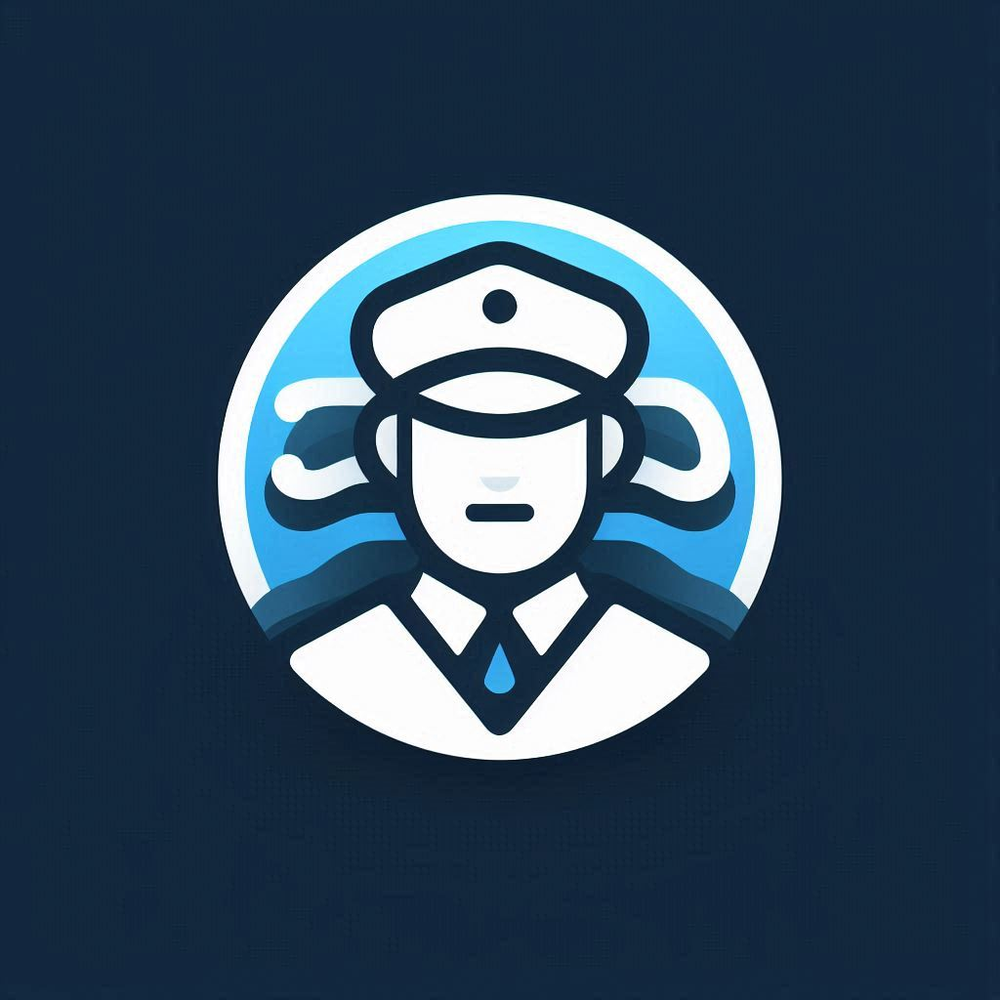
</p>

**Smart Hiring, Made Simple.**

Welcome to IntelliHire! This app is like a smart assistant for recruiters. It helps make the hiring process easier and faster by using an **advanced AI model** to handle some of the most time-consuming tasks. Imagine quickly finding the best candidates without spending hours reading every single CV!

---

## ✨ IntelliHire: What It Does

Recruiting can be overwhelming. IntelliHire uses its **smart AI model** to help you:
* Quickly understand what each job requires.
* Automatically read and get key info from CVs (PDFs, images, text).
* Match the right CVs to the right jobs.
* Create a shortlist of the best candidates.
* Get ready to contact them for interviews.

---

## 🎯 The Problem We're Solving

**(Hackathon Problem ID: R1-05 - Enhancing Job Screening)**

Traditional hiring is tough:
* **Too Time-Consuming:** Recruiters can spend about **23 hours** screening CVs for just one hire (Eddy.com).
* **Costly & Slow:** Manual work makes hiring take longer and cost more.
* **Prone to Errors & Bias:** Humans can make mistakes or be unintentionally biased.
* **Hard to Scale:** Many companies get too many CVs to review them all properly (TestGorilla).

**Result:** Longer hiring times, higher costs, and potentially missing out on great talent.

---

## 💡 Our Solution: IntelliHire

IntelliHire tackles these issues with its "AI helper" agents:
1.  **Smart JD Analysis:** The AI understands job descriptions.
2.  **Efficient CV Processing:** The AI reads CVs and extracts key details.
3.  **Accurate Matching:** AI compares CVs to job needs.
4.  **Automated Shortlisting:** Creates a list of top candidates based on your rules.
5.  **Easy Interview Prep:** Helps you contact shortlisted candidates.

**Benefits:**
* Saves lots of time.
* More accurate and fair.
* Faster shortlisting.
* Lets recruiters focus on people, not paperwork!

---

## 🚀 Core Features

* **Easy Job Input:** Add job details and what you're looking for (skills, experience, etc.).
* **AI JD Helper:** Summarizes JDs and finds key requirements using our **trained AI model**.
* **CV Uploader:** Upload up to **10 CVs at once** (PDF, Word, text, images from camera/files).
* **AI CV Reader:** Extracts info from CVs using our **AI model**.
* **AI Matching:** Scores how well each CV fits the job.
* **Automated Shortlisting:** Creates a top candidate list based on your settings.
* **Interview Assistance:** Helps start the interview process.
* **History Tracking:** Saves all your jobs and shortlists.

---

## 🛠️ Tech Stack

* **App:** Flutter (Dart) – For Android & iOS.
* **Backend Logic:** Python Cloud Functions on Firebase – Securely runs our AI tasks.
* **AI Engine:** **A sophisticated trained AI model** (accessed securely from our backend).
* **Database:** Firebase Firestore – Stores all app data.
* **Login:** Firebase Authentication.

---

## 🌊 How IntelliHire Works (System Flow)

### High-Level Flowchart

*(This is where you'll insert your actual flowchart image! If you don't have one, you can describe the steps simply or remove this sub-section.)*

**A quick text description of the flow:**
1.  Recruiter enters Job Details in the Flutter app.
2.  A Python Cloud Function uses the **AI model** to understand the JD & saves it.
3.  Recruiter uploads CVs in the app.
4.  Another Cloud Function uses the **AI model** to read each CV, compare it to the JD, and score it. Results are saved.
5.  Recruiter tells the app to create a shortlist.
6.  A Cloud Function applies the recruiter's rules to the scores and marks the top candidates.
7.  Recruiter views the shortlist and can start contacting candidates.

### Simple Architecture

* **Flutter App:** The part the recruiter uses.
* **Python Cloud Functions:** Secure "helpers" in the cloud that use the **AI model**.
* **Firebase:** Handles login and data storage.
* **AI Model (via API):** The "brain" that understands text and helps with analysis.

---

## 🤖 Our "AI Helper" Team (Logical Agents)

IntelliHire's smarts are organized into logical "agents" working in the backend:

* **JD Helper:** Understands JDs using the **AI model**.
* **CV Helper:** Reads CVs and extracts info using the **AI model**.
* **Matching Helper:** Compares CVs to JDs using the **AI model's** understanding.
* **Shortlisting Helper:** Applies recruiter rules to pick the top candidates.
* **Interview Helper:** Helps start the interview process (currently via your phone's email app).

---

## 📱 Application Screenshots

Here's a glimpse of IntelliHire in action!

**Initial Views:**
* **Splash Screen:**
    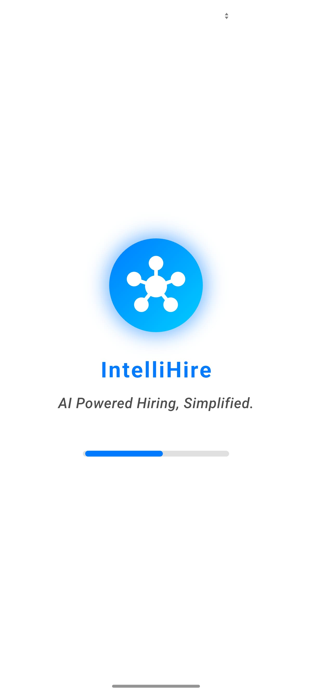

**Job Description Management:**
* **Job Description Page Example 1:**
    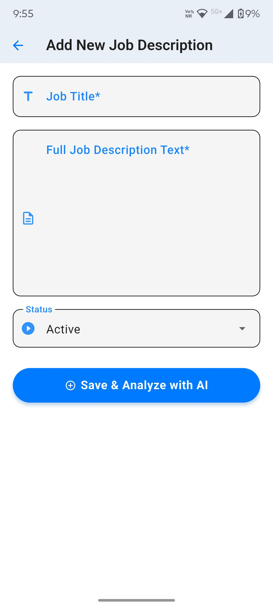
* **Job Description Page Example 2:**
    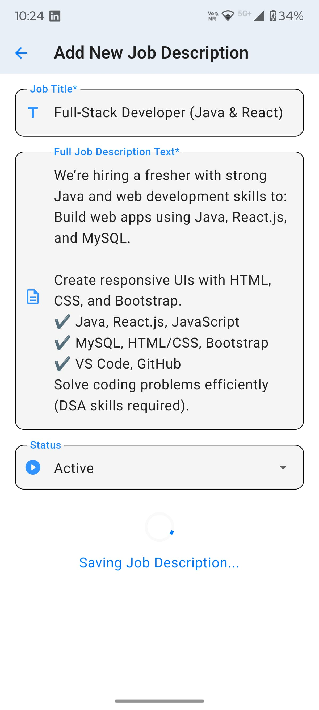

**CV Analysis Process:**
* **CV Analysis Overview Page:**
    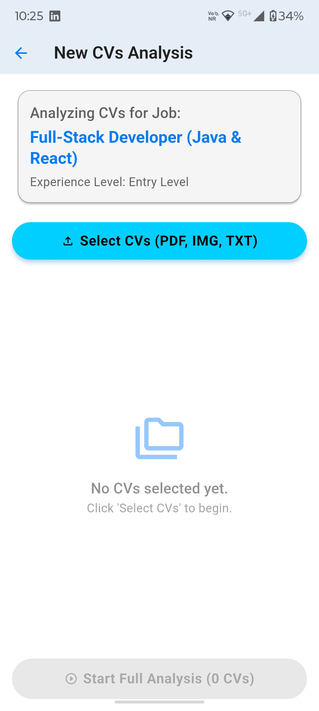
* **CV Analysis Details (Example 1):**
    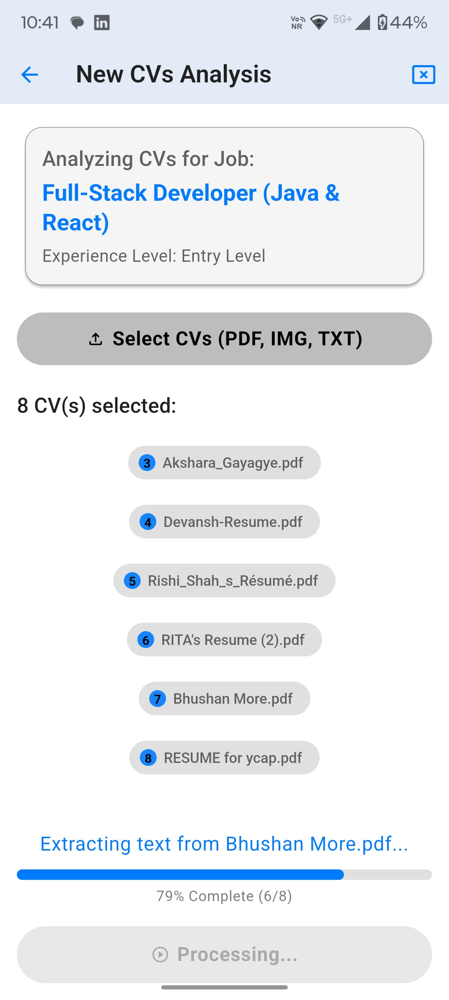
* **CV Analysis Details (Example 2):**
    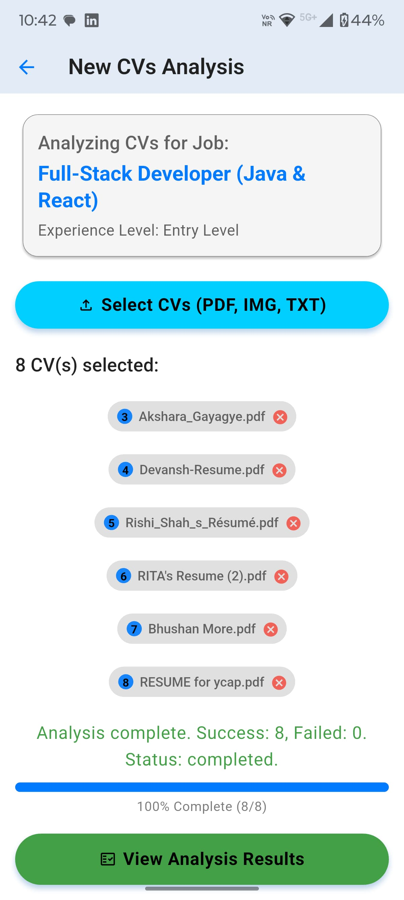
* **CV Analysis with Resume View:**
     * **Individual Candidate Analysis:**
    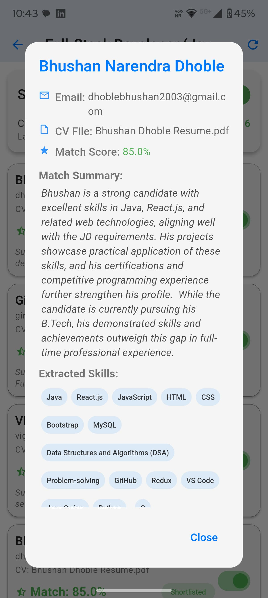

**Shortlisting & Contact:**
* **Shortlisting View Example 1:**
    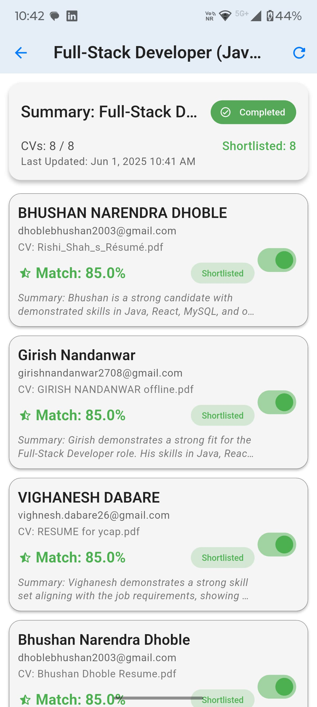
* **Shortlisting View Example 2:**
    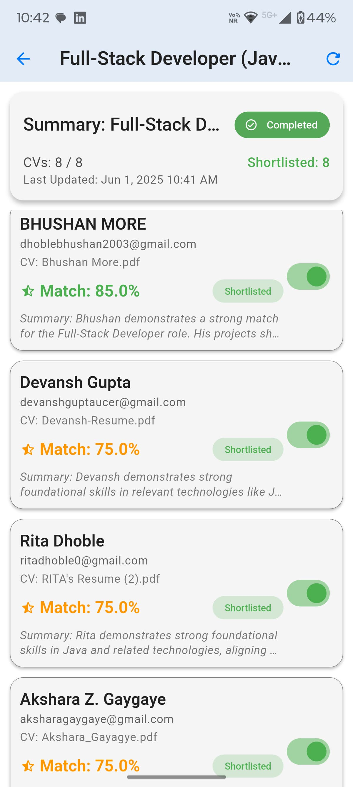
* **Email Initiation Screen:**
    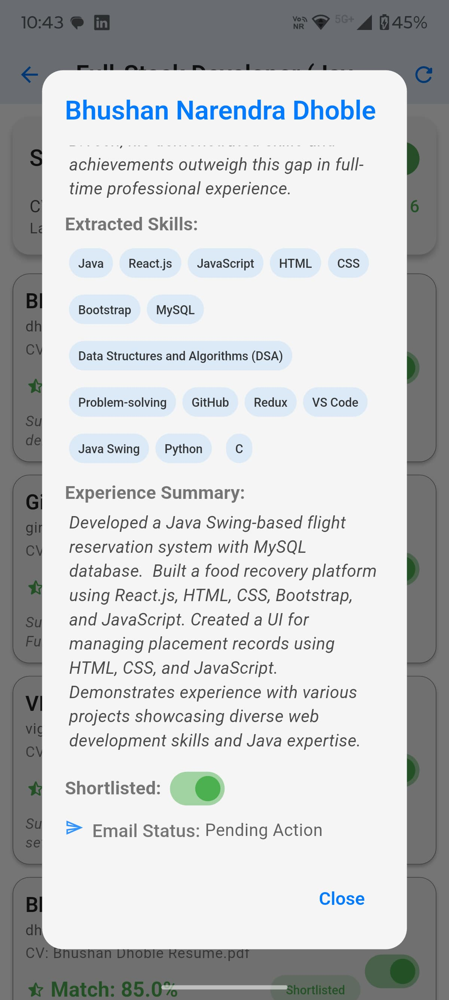
---

## 📂 File Structure (A Quick Look)

### Flutter App (`lib/` folder)

intellihire_app/
├── lib/
│   ├── main.dart         # App starts here
│   ├── models/           # Data structures
│   ├── screens/          # App pages
│   └── services/         # Helpers for backend, etc.
├── assets/
│   └── images/           # Your app screenshots and logo
│       ├── cv_analysis_of_candidate.jpg
│       ├── cv_analysis_page.jpg
│       ├── ... (all your other images)
│       └── splash_screen.jpg
└── pubspec.yaml        # App tools (ensure assets are declared here)

**(Remember to declare your `assets/images/` folder in your `pubspec.yaml` file under `flutter:` `assets:`)**
```yaml
# pubspec.yaml
flutter:
  uses-material-design: true
  assets:
    - assets/images/ # This line includes all files in the images folder
Python Cloud Functions (functions/ folder - for backend)
functions/
├── main.py             # Python code for AI helpers
└── requirements.txt    # Python tools needed
📄 License
This project is under the [Your License Type, e.g., MIT License]. See LICENSE file.

🧑‍💻 The IntelliHire Team
   1. Bhushan Dhoble
   2. Amol Dhote
   3. Yogendra Karri
